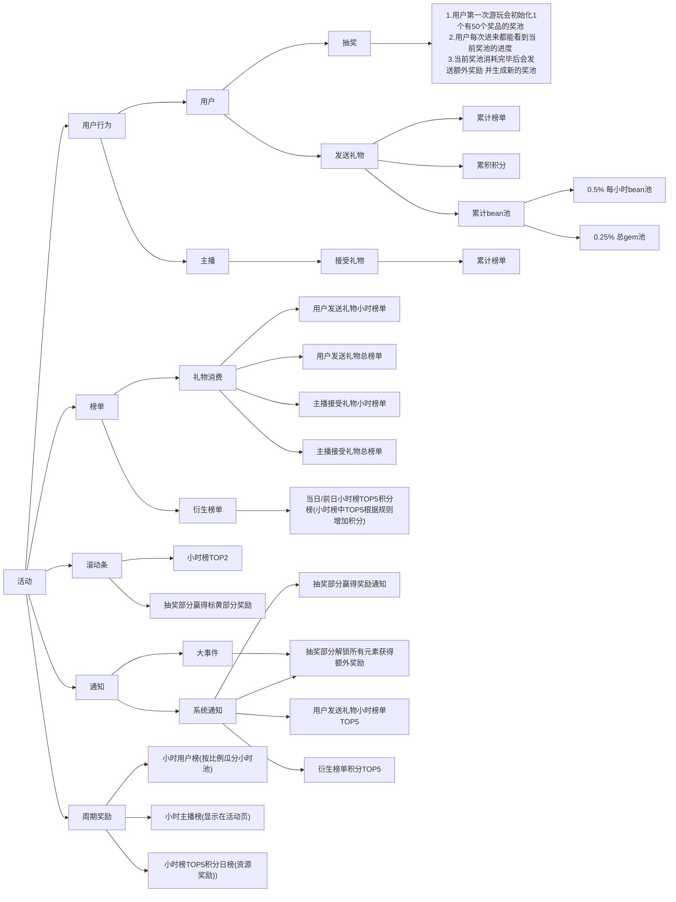

```mermaid 
flowchart LR

 id2["1.用户第一次游玩会初始化1个有50个奖品的奖池 <br> 2.用户每次进来都能看到当前奖池的进度 <br>3.当前奖池消耗完毕后会发送额外奖励 并生成新的奖池"]
    活动 --> 用户行为
    活动 --> 榜单
    活动 --> 滚动条
    活动 --> 通知
    活动 --> 周期奖励
    用户行为 --> 用户
    用户 --> 发送礼物 --> 累计榜单
     发送礼物 --> 累积积分
     发送礼物 --> 累计bean池 --> id8["0.5% 每小时bean池"]
 累计bean池 --> id9["0.25% 总gem池"]

    用户 --> 抽奖 --> id2

    用户行为 --> 主播 --> 接受礼物 --> id6[累计榜单]


    榜单 --> 礼物消费 
    礼物消费 --> 用户发送礼物小时榜单
    礼物消费 --> 用户发送礼物总榜单
    礼物消费 --> 主播接受礼物小时榜单
    礼物消费 --> 主播接受礼物总榜单


    榜单 --> 衍生榜单
    衍生榜单 --> id1["当日/前日小时榜TOP5积分榜(小时榜中TOP5根据规则增加积分)"]

    滚动条 --> 小时榜TOP2
    滚动条 --> 抽奖部分赢得标黄部分奖励

    通知 --> 系统通知 -->抽奖部分赢得奖励通知
     系统通知 -->抽奖部分解锁所有元素获得额外奖励
     系统通知 -->用户发送礼物小时榜单TOP5
     系统通知 -->衍生榜单积分TOP5
    通知 --> 大事件 
    大事件 -->抽奖部分解锁所有元素获得额外奖励

    周期奖励 --> id3["小时用户榜(按比例瓜分小时池)"]
    周期奖励 --> id4["小时主播榜(显示在活动页)"]
    周期奖励 -->  id5["小时榜TOP5积分日榜(资源奖励))"]
```